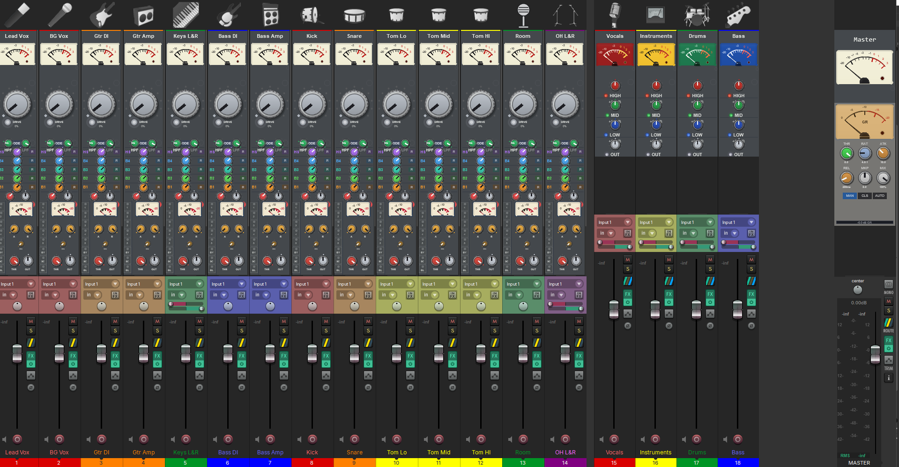
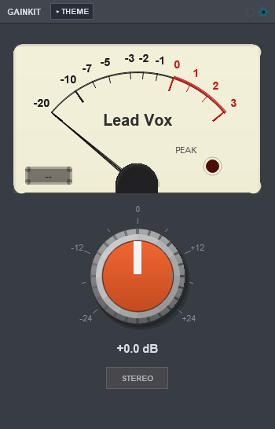
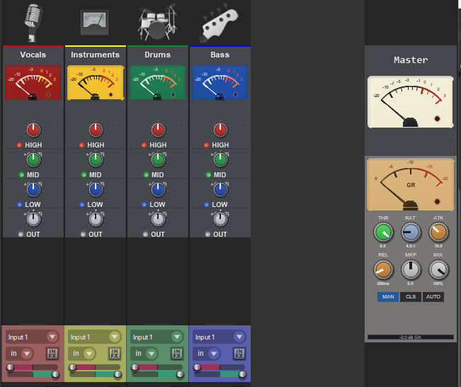
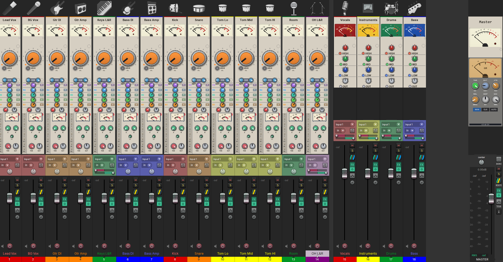
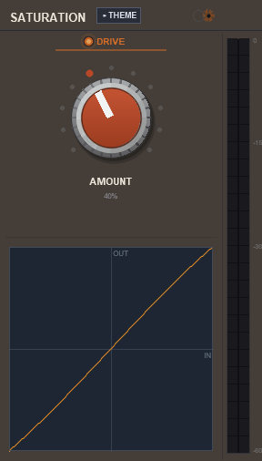
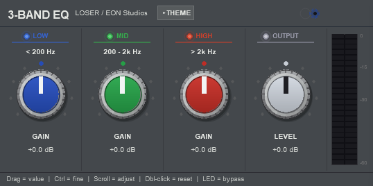
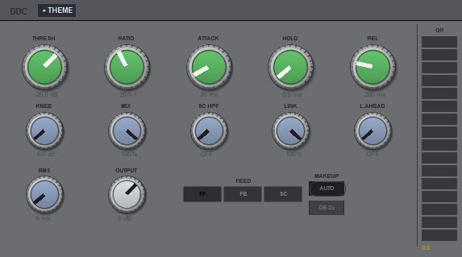
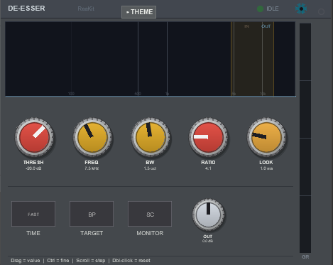
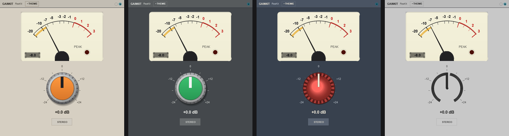

# ReaKit FX

Five free effects for REAPER with EON Studios interfaces, drawn by the
[ReaKit](https://github.com/mequaz-sudo/ReaKit) library: Saturation, 3-Band EQ and DDC by
LOSER, a De-Esser built on Liteon's, and GainKit, EON's own gain-staging plugin. Every face is
code, no image files, so it scales to any size and renders at full resolution on HiDPI.



*A session on the suite's SSL theme with GainKit Plus running. Every channel starts with GainKit's
VU, its track's name over the meter and its colour along the top; Saturation and DDC sit under it.
The four buses on the right keep their own meter faces, with 3-Band EQ under each, and the master
ends in GainKit, 3-Band EQ and DDC. Click a strip's empty space to open the window, click the strip
again to close it; drag the meter to set the gain.*

## The plugins

### GainKit





*Four buses and the master: the VU alone with the name over it, each bus on its own meter face,
3-Band EQ under the buses and DDC under the master's meter. The master's name is set in another
face, picked on the THEME panel's FONT row.*

Gain staging on a VU. An analog VU meter (the ReaKit meter: 300 ms to 99 %, 1.2 % overshoot, 20
faces), one GAIN knob and a STEREO / MONO key. In the mixer strip it shows the VU over the knob,
the VU alone, or the knob alone, with numerals or ticks only, and the VU grows flatter as you drag
the strip wider. Click the middle of the meter's face and type, and the name is printed on the meter
like a legend. The high-pass, low-pass, trims and M/S modes it used to show are still there as
parameters, so old projects sound the same.

#### GainKit Plus

Actions that come with GainKit (install **GainKit Plus** from the same repository; they appear
in the Actions list as `Script: GainKit Plus…`):

- **GainKit Plus** — run it once and every GainKit in the project shows its track's name as the
  meter's legend, the track's colour as a thin bar along the top of the strip (and under the
  window's header), and the track's icon in the window's header. A name typed on the meter
  still wins. Run it again to stop; put it on a toolbar and the button lights while it runs.
- **Insert on selected tracks** — GainKit first in the chain of every selected track that has
  none.
- **GainKit first in every chain** — moves the GainKit a track already has to the top of its
  chain, the master's too.
- **Reset all gains** — every GainKit's GAIN back to 0 dB.
- **All MONO** / **All STEREO** — every GainKit's key at once.
- **Bypass all** — every GainKit off; run it again and they are all on.
- **Start with REAPER** — GainKit Plus starts with REAPER from now on (it goes into
  `Scripts/__startup.lua`, nothing else there is touched); run it again to take it out.

In the mixer strip the meter itself is the gain control: drag it up or down (Ctrl fine, Shift
finer), the wheel steps it, double-click or right-click returns it to 0 dB, and the value shows
under a VU-only meter for a moment. The rest of the strip still opens the window with a click.
The THEME panel's FONT row picks the face the name is printed in, on the window's meter and
under the strip's.



*The same session on the EON theme: the names and colours come from the tracks, the meters from
GainKit Plus, nothing typed.*

### Saturation



LOSER's saturation: one DRIVE knob, a transfer display that shows what the drive is doing to the
signal, and an output meter. The LED bypasses it.

### 3-Band EQ



LOSER's three-band equalizer: low, mid and high gain with the two crossover frequencies, an output
level, and a switch per band. The standalone window draws everything at one scale, so a wider
window gets bigger knobs, not more empty space.

### DDC



LOSER's Digital Drum Compressor: threshold, ratio, attack, hold and release, knee, mix, a
sidechain high-pass, stereo link, lookahead, RMS or peak detection, feed-forward, feedback or an
external sidechain, auto makeup, oversampling, and a gain-reduction meter.

### De-Esser



Built on Liteon's de-esser: threshold, frequency, bandwidth, ratio and lookahead, a fast time
setting, a band-pass target instead of the broadband one, and a switch to monitor the sidechain.
The display shows the band it is listening to.

## Across the plugins

- **Embeds** — every plugin has a face for the mixer strip and the track panel, sized from the
  slot it is given.
- **THEME panel** — GainKit, Saturation, 3-Band EQ and De-Esser have a THEME toggle in the header:
  a colour theme, a knob style (21 of them), the name bar over the mixer-strip embed, and NATIVE,
  which opts an instance out of theming. GainKit's panel also picks the VU's face and has LOCK,
  which freezes that instance's look while the rest follows the theme. DDC has no panel of its
  own; its colours and knobs follow the suite's theme.

  

  *GainKit on the EON, SSL, Neve and Ableton themes: the colours and the knob follow the theme, the
  meter is the meter.*
- **Link groups** — the gear in the header of those four puts an instance in a group; instances
  in the same group move together.
- **The mouse** — drag a knob, Ctrl for fine, Shift for finer, the wheel steps it, double-click
  resets it, right-click returns it to its default.

## Install (ReaPack)

Extensions > ReaPack > Import repositories, paste:

```
https://raw.githubusercontent.com/mequaz-sudo/ReaKit-FX/main/index.xml
```

Then install **ReaKit FX** from the browser, and **GainKit Plus** for the scripts. The plugins appear in REAPER's FX list as
`JS: EON: GainKit`, `JS: EON: Saturation`, `JS: EON: 3-Band EQ`, `JS: EON: DDC` and
`JS: EON: De-Esser`.

These effects used to ship from the ReaKit repository as "ReaKit Free FX". If you installed them
there, ReaPack now lists that package as obsolete: uninstall it and install this one.

## Licence

Saturation, 3-Band EQ and DDC keep their DSP author's terms, Michael Gruhn (LOSER); the De-Esser's
crossover and detector are Lubomir I. Ivanov's (Liteon). Each plugin file carries its original
header. GainKit is EON Studios' own code, MIT. The `ReaKit/` includes are the ReaKit library, MIT.
The full text is in [LICENSE.md](LICENSE.md).

## Building on it

The `ReaKit/` folder is a copy of the ReaKit library the plugins import (`import
../../ReaKit/<file>`): the released library, plus the label-font hook in `rk_vu.jsfx-inc` that
GainKit 2.3.0 uses (the library's next release carries it). Nothing else is needed: install
the package and the plugins compile. To write your own, start from the
[ReaKit](https://github.com/mequaz-sudo/ReaKit) repository's showcase and Starter.

*The two session pictures, the strips and the five windows are screenshots of working sessions
on the SSL and EON themes. The four-theme strip is a script's: a sandbox REAPER at 100 % publishes a suite theme the
way the bridge does, opens the window and crops to its canvas. Every pixel is the plugin drawing
itself.*
