# ReaKit FX

Seven free effects for REAPER with EON Studios interfaces, drawn by the
[ReaKit](https://github.com/mequaz-sudo/ReaKit) library: Saturation, 3-Band EQ and DDC by
LOSER, a De-Esser built on Liteon's, and EON's own GainKit, Stereo Width and Filter. Every face is
code, no image files, so it scales to any size and renders at full resolution on HiDPI. The
GainKit Plus package adds a dock that keeps the selected track's effects in view: see
[The ReaKit FX dock](#the-reakit-fx-dock).

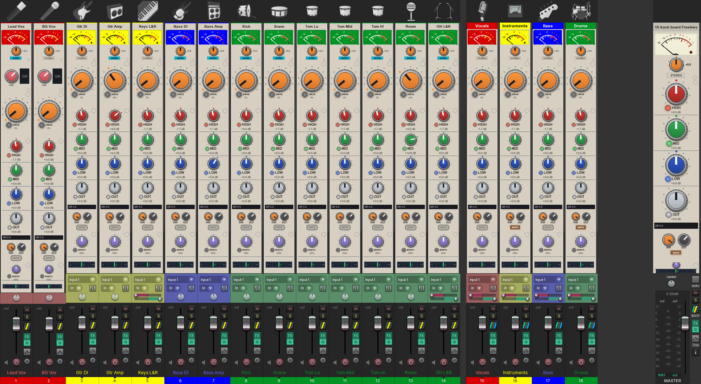

*Six of the seven, embedded, on every channel of a session, on a REAPER with nothing but this package
installed: GainKit on top (the track's name and colour from GainKit Plus), Saturation, the 3-Band
EQ, DDC with its gain-reduction bar, and Stereo Width at the bottom; the De-Esser sits on the two
vocal tracks. This is the EON theme, the look a fresh install opens on. Click a strip's empty
space to open a plugin's window, click the strip again to close it.*

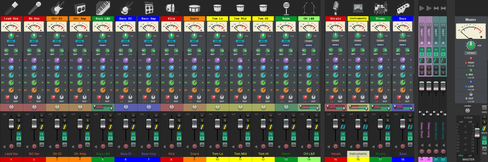

*A session on the suite's SSL theme with GainKit Plus running. Every channel and bus starts with
GainKit: the track's name on a band in the track's colour, the VU over the GAIN knob, and the
STEREO / MONO key. 4-Band EQ from the EON suite sits under it; the master runs GainKit and 3-Band
EQ, its name typed. Click a strip's empty space to open the window, click the strip again to close
it; with VU DRAG on, drag the meter to set the gain.*

## The plugins

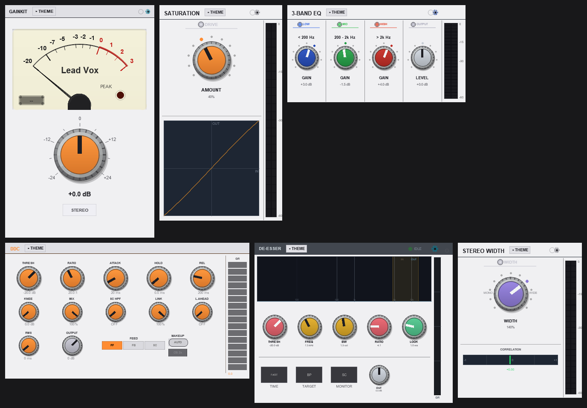

*Six of the seven windows on the Light theme.*

### GainKit


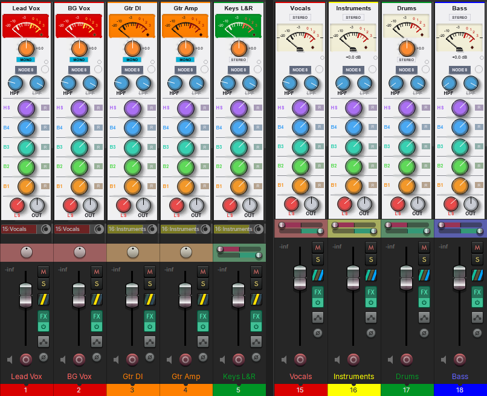

*GainKit in the mixer on the Light theme, GainKit Plus running. The five channels show the VU over
the GAIN knob, the meter in the track's colour and the name on top. Three of the buses show the VU
alone: the STEREO / MONO key under the name and, on two of them, the gain under the meter. Drums
shows the VU over the knob. Under GainKit: 4-Band EQ from the EON suite.*

Gain staging on a VU. An analog VU meter (the ReaKit meter: 300 ms to 99 %, 1.2 % overshoot, 20
faces), one GAIN knob and a STEREO / MONO key. The needle reads the louder side, so a sound panned
hard to one side reads at its real level; METERS = TWO shows a meter for each side instead, in the
window (with a trim knob for each side) and in the strip. In the mixer strip it shows the VU over
the knob, the VU alone, or the knob alone, with numerals or ticks only, and the VU grows flatter as
you drag the strip wider. The VU alone keeps its own STEREO / MONO key under the name (ST/MONO
hides it; MONO then shows as a small cyan dot) and prints the value under the meter while you set
it, or all the time. The track's name is printed on the meter like a legend and on top of the
strip. Click the middle of the window's meter face and type, and that renames the track itself
(with GainKit Plus running), so the meter, the dock and REAPER always agree. The name shows in every view:
as a plain row, on a band in the track's colour, or not at all. The M/S modes it used to show are
still there as parameters, so old projects sound the same.

The low and high cut are back on the face as an option. The THEME panel's LOOK page: FILTERS shows
them in the window as a DRAWER under the face (the response, and a bar with a handle for each cut)
or as a BAR under the face, or not at all (the default); TRIMS shows or hides the window's L / R
trim knobs with TWO meters (a trim set away from 0 shows as a badge when hidden). Its STRIP page
does the same for the mixer strip: FILTERS puts the cut bar along the bottom of the strip, TRIMS a
small L / R trim beside the gain knob (with TWO meters); both are off by default. Drag a handle (Ctrl for fine),
wheel it a semitone at a time, or double-click it to switch that cut off; a cutoff glides to a new
setting, so a sweep or an automation step never clicks.

With GainKit Plus running, a strip with its FILTERS bar on shows a small arrow at the bar's right
end: it opens the long view, the same strip with the cuts' response and their bar under it, and an
arrow there brings the short strip back. The mixer strip grows by the room the long view takes where
it can (not the master's), so the effects under it keep theirs; the swap keeps every setting and does not interrupt the sound.

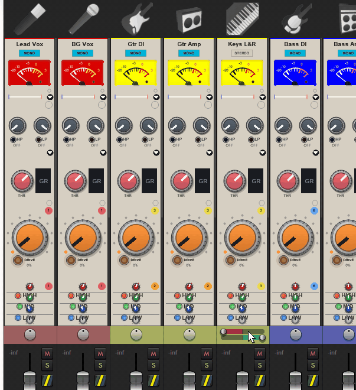

*The first track's Filter, then the second track's GainKit: the arrow opens the long view, the strip grows for it, and the
arrow brings the short strip back.*

The THEME panel's METER tab sets how the meter reads: where 0 VU sits (-18, -20 or -14 dBFS), how
fast the needle moves (the standard speed, twice as fast, or half), what marks the last high (a
second needle, the arc, or nothing), the number on the window's meter (the VU reading, the peak in
dBFS, or the highest peak, cleared with a click on it), and when the PEAK light comes on (above -6,
-3 or -1 dBFS; -6 by default).

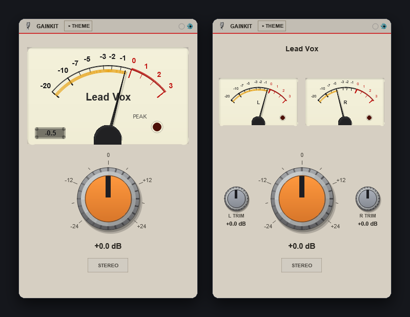

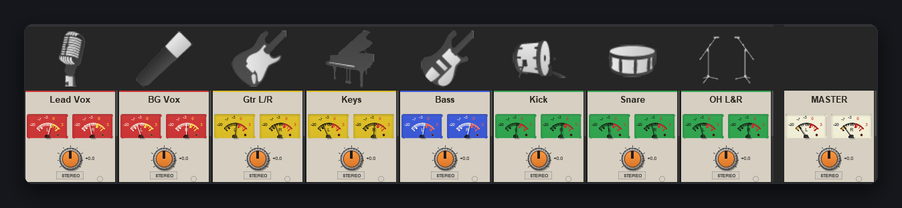

*METERS on ONE and on TWO: a meter for each side, with a trim knob under each in the window, and
two meters in every strip and on the master, here in the track's colour.*

#### GainKit Plus

Actions that come with GainKit (install **GainKit Plus** from the same repository; they appear
in the Actions list as `Script: GainKit Plus…`):

- **GainKit Plus** — run it once and every GainKit in the project shows its track's name on top
  of the strip and as the meter's legend, the track's colour along the top of the strip or as the
  name's band (and under the window's header), and the track's icon in the window's header; the
  meter can take the colour too. The master's GainKit shows the project's name. A name typed on
  the meter renames the track. Run it again to stop; put it on a toolbar and the button lights while it
  runs. On REAPER 7.81 and later every GainKit reads its track's name from REAPER itself, so
  the name needs no script there; the colour, the icon and the master's project name still come
  from GainKit Plus, which serves the first 512 tracks. It also carries out the THEME panel's EMBED
  row (it moves the plugin and sets where new copies of the seven open) and the long-view arrow on
  a GainKit's or a Filter's strip.
- **Insert on selected tracks** — GainKit first in the chain of every selected track that has
  none, opened embedded in the mixer strip.
- **GainKit first in every chain** — moves the GainKit a track already has to the top of its
  chain, the master's too.
- **GainKit first on selected tracks** — the same, for the selected tracks only.
- **GainKit last on the master** — moves the master's GainKit to the end of its chain, or adds
  one there, so the mix gets a final VU after everything else.
- **Copy look to all** — the look of the selected track's GainKit (what the strip shows, the name
  row and its font, the meter's colour, VALUE, METERS, VU DRAG, ST/MONO, NAME BAR, NATIVE and the
  METER tab) on every GainKit at once.
- **Reset all gains** — every GainKit's GAIN back to 0 dB.
- **All MONO** / **All STEREO** — every GainKit's key at once.
- **Bypass all** — every GainKit off; run it again and they are all on.
- **Remove all GainKits** — takes GainKit off every track after asking once; Undo puts them back.
- **Start with REAPER** — GainKit Plus starts with REAPER from now on (it goes into
  `Scripts/__startup.lua`, nothing else there is touched); run it again to take it out.
- **ReaKit FX - Start with REAPER** — one press for everything: GainKit Plus into the start-up
  file, and EON Floatter started once so it registers itself. Once, it sets the seven to open
  embedded in the mixer strip (REAPER's own default for new instances; any of the seven you had set
  to open in the track panel moves too, and the window names it; other plugins' defaults are left
  as they are); after a reinstall or a moved folder, GainKit Plus gives the seven's new copies
  the same place at its next start, and a place you set yourself stays as you left it. The first time, it also offers a track
  with all seven, the 16 track board in a new project tab, and to raise REAPER's meter refresh to 120 a second so the
  mixer strips answer quicker (from the next start). Run it again and nothing changes.
- **ReaKit FX - Add a track with all seven** — a track called ReaKit FX at the end of the project
  with GainKit, Filter, De-Esser, Saturation, 3-Band EQ, DDC and Stereo Width, in that order, their
  windows open side by side. One undo step.
- **ReaKit FX - Dock following the selected track** — the selected track's ReaKit FX in a docker
  tab (see [The ReaKit FX dock](#the-reakit-fx-dock) below).
- **ReaKit FX - Docker tabs off-on** — REAPER's tab bar off for every docker holding one window
  (a docker holding two keeps its tabs, to switch between them); run it again and the tabs are
  back as they were. It is REAPER's own setting, so it holds for every docker and after a restart;
  when the dock closes with the tabs hidden they come back, and the dock hides them again when it opens.

The actions and the names reach a GainKit inside an FX container too.

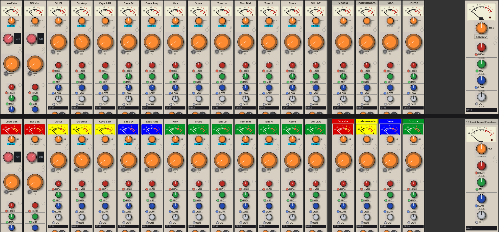

*Plus off (top) and on (bottom), on REAPER 7.81: the names are there either way, from REAPER
itself; Plus adds the track's colour on the name band and the meter, the icon in the window's
header, and the project's name on the master.*

With the THEME panel's VU DRAG on, the meter in the mixer strip is the gain control: drag it up or
down (Ctrl fine, Shift finer), the wheel steps it, double-click returns it to 0 dB, the VU alone
shows the gain as a tint of the meter's face (up from the middle for a boost, down for a cut), and
the value shows under it while you set it and a moment after. VU DRAG is off by default: the meter
then only reads, and a click on it opens the window like the rest of the strip. The THEME panel's FONT row picks the face the name is printed in, on the
window's meter and on top of the strip.


*The same session on the EON theme. The channels and buses take their names and colours from
their tracks, through GainKit Plus; the master's name is typed.*

### Saturation


LOSER's saturation: one DRIVE knob, a transfer display that shows what the drive is doing to the
signal, and an output meter. The DRIVE light follows the drive, from a dim ember to a hot orange.
The LED bypasses it. In a short window, as in the dock, the display
steps aside and the knob takes the room; the CURVE button opens the display over the knob, and a
click anywhere else closes it. In its own window, the strip along the bottom edge drops a CURVE
drawer under the knob: the window grows for it (EON Floatter running) and the knob keeps its place.
In the dock the knob stands alone and a CURVE chip pops the curve over it. In a very short window
the DRIVE row folds onto the knob's line, so the knob stays whole.

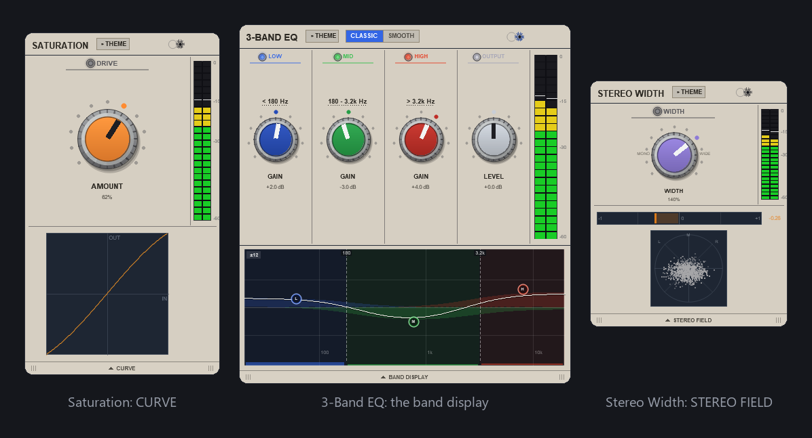

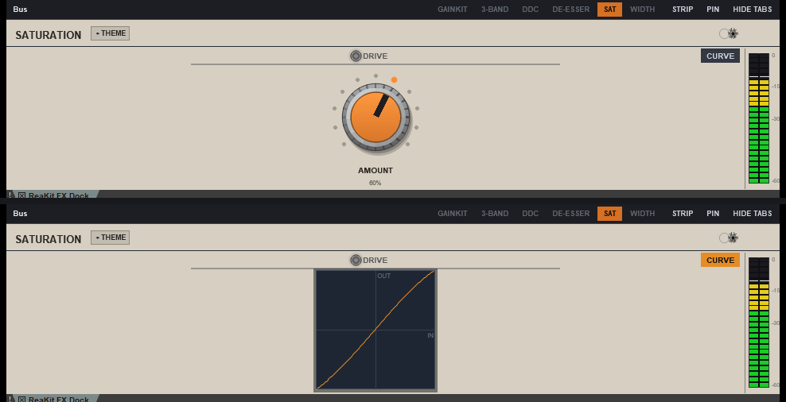

### 3-Band EQ


LOSER's three-band equalizer: low, mid and high gain with the two crossover frequencies, an output
level, and a switch per band. The crossovers show their frequencies live, and the filter comes in
two voices: CLASSIC, LOSER's original band split, and SMOOTH, EON's stacked shelves that turn exactly
on the crossover lines. The strip along the bottom edge
drops a band display: the curve, a dot per band to drag (up and down for the gain, sideways for the
crossover; the MID dot slides its whole band, and the wheel over it widens or narrows the band),
and the two crossover lines to drag. The standalone window draws everything at one scale, so a
wider window gets bigger knobs, not more empty space. In a short window the band names go (the
knobs' colours and the crossover labels say which is which), and the values sit right under the knobs.

### DDC


LOSER's Digital Drum Compressor: threshold, ratio, attack, hold and release, knee, mix, a
sidechain high-pass, stereo link, lookahead, RMS or peak detection, feed-forward, feedback or an
external sidechain, auto makeup, a detector that can run at double rate (DET 2x: the level detector, not the audio; it reads some peaks that fall between samples a little higher, in the upper mids, and holds the audio back two samples so it never acts late), and a gain-reduction meter.
In a short, wide window, as in a docker under the tracks, the knobs move from three rows to two,
or to one row of all twelve with the switches at its end, and go back to three when there is room.

### De-Esser


Built on Liteon's de-esser: threshold, frequency, bandwidth, ratio and lookahead, a fast time
setting, a band-pass target instead of the broadband one, and a switch to monitor the sidechain.
The display shows the band it is listening to. In a short window the controls go to one row, with
the switches stacked at the right, and the display takes whatever room is left above them.

### Stereo Width

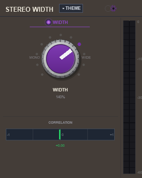

One knob, 0 to 200 %: mono at the left end, the recorded width in the middle, wider to the right.
It scales the side signal and leaves the middle alone, so the centre of the mix never moves. A
correlation meter under the knob shows how the two channels agree. The strip along the bottom edge
drops a STEREO FIELD drawer: the stereo picture of the signal, live, with the correlation meter
above it. The WIDTH light runs blue at mono, green at 100 % and yellow at 200 %. In a mixer strip
it is the WIDTH knob at the bottom of the channel; a click on its correlation meter folds the meter
away and gives the knob the strip, and the small CORR tab brings it back (each copy remembers). In a
very short window the WIDTH row folds onto the knob's line, so the knob stays whole.

### Filter

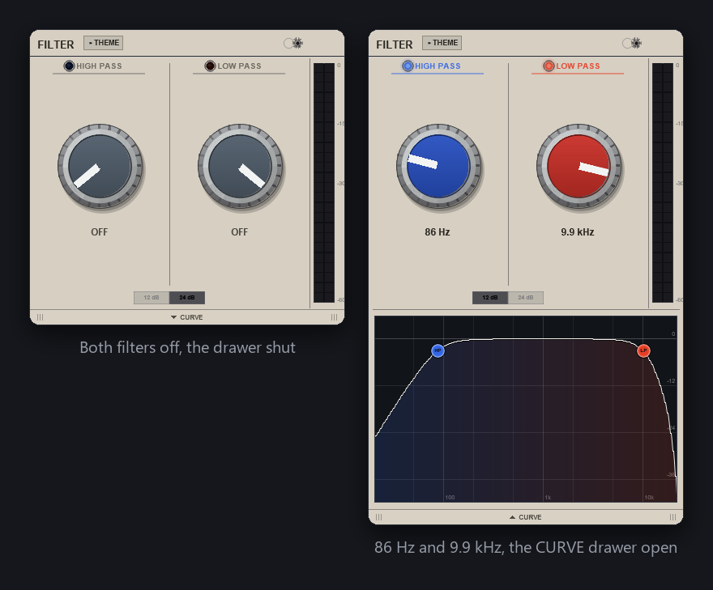

A high-pass and a low-pass, nothing else: two knobs, HIGH PASS and LOW PASS, each 20 Hz to
20 kHz, and a SLOPE key for 12 or 24 dB per octave. A knob at the end of its travel is OFF (the
high-pass at 20 Hz, the low-pass at 20 kHz) and its light goes out; a click on the light switches
the filter off and brings it back where it was. The filters are Butterworth, built on Andrew
Simper's trapezoidal state-variable stages (the same stages as the 3-Band EQ's SMOOTH voice): the
corner lands exactly on the knob's value, and the cutoff glides to a new setting (a 5 ms time
constant), so a knob sweep or an automation ramp is continuous, with no zipper. A filter switched
on or off fades over 5 ms; a slope switch lets the new slope settle for a tenth of a second, then
crossfades over 10 ms, so nothing clicks. The strip along the bottom edge drops a CURVE drawer (the
window grows for it with EON Floatter running): the response, with a node per filter at its
corner to drag sideways, scroll a semitone at a time, or double-click to switch off. In a mixer
strip or the track panel it is the two knobs side by side. With GainKit Plus running, a small arrow
at the strip's bottom right opens the long view: the same knobs with the curve and its two nodes
under them, and an arrow back. The mixer strip grows by the room the long view takes where it can,
so the effects under it keep theirs; the swap keeps every setting and does not interrupt the sound. In
the dock, the CURVE chip pops the curve over the knobs.

## The ReaKit FX dock

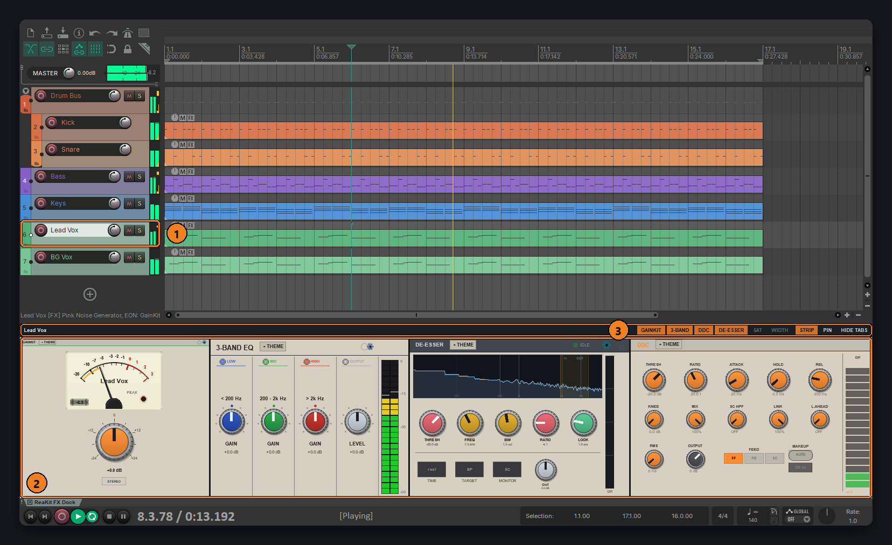

*Select a track (1) and its ReaKit FX open in the dock (2), whole and working: here Lead Vox's
GainKit, 3-Band EQ, De-Esser and DDC, side by side in the order of its chain. The bar (3) runs
along the top.*

**ReaKit FX - Dock following the selected track** comes with GainKit Plus. Run it and the
selected track's ReaKit FX open in a docker tab; run it again to close the dock. GainKit Plus,
starting with REAPER, opens it again if it was open when REAPER closed. The dock runs on Windows
and needs js_ReaScriptAPI (ReaPack).

### It follows your selection

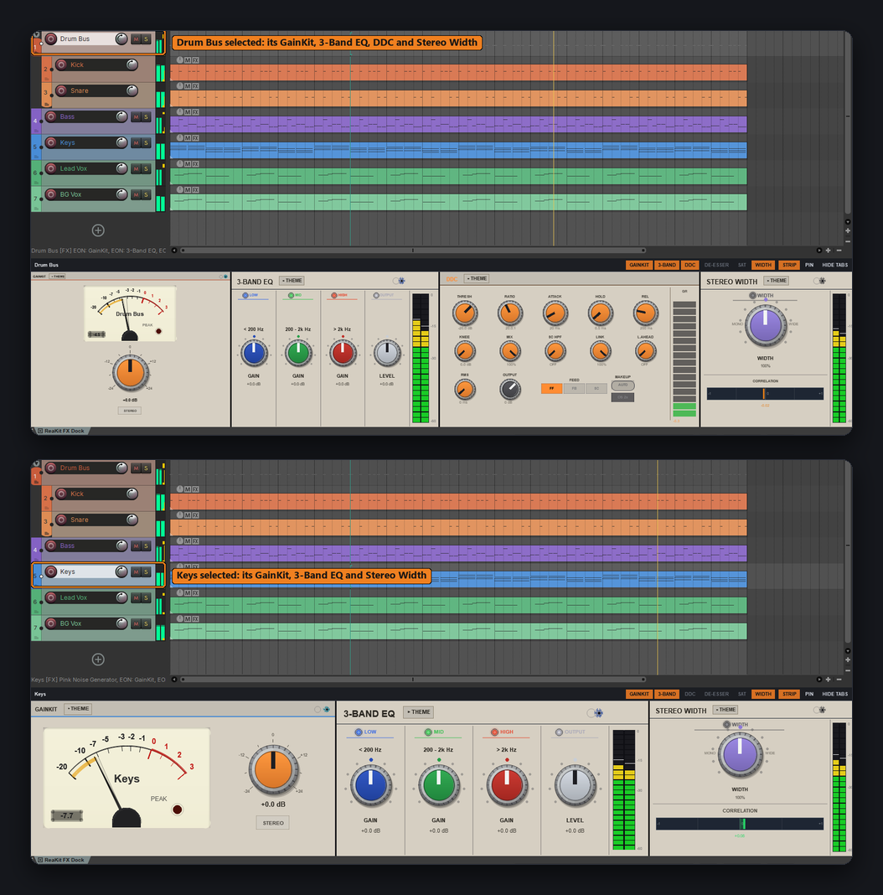

Click another track and the dock shows its effects. A track without any keeps the last ones on
view. **PIN** keeps the dock on one track (or the master) whatever you select.

### Double-click a name

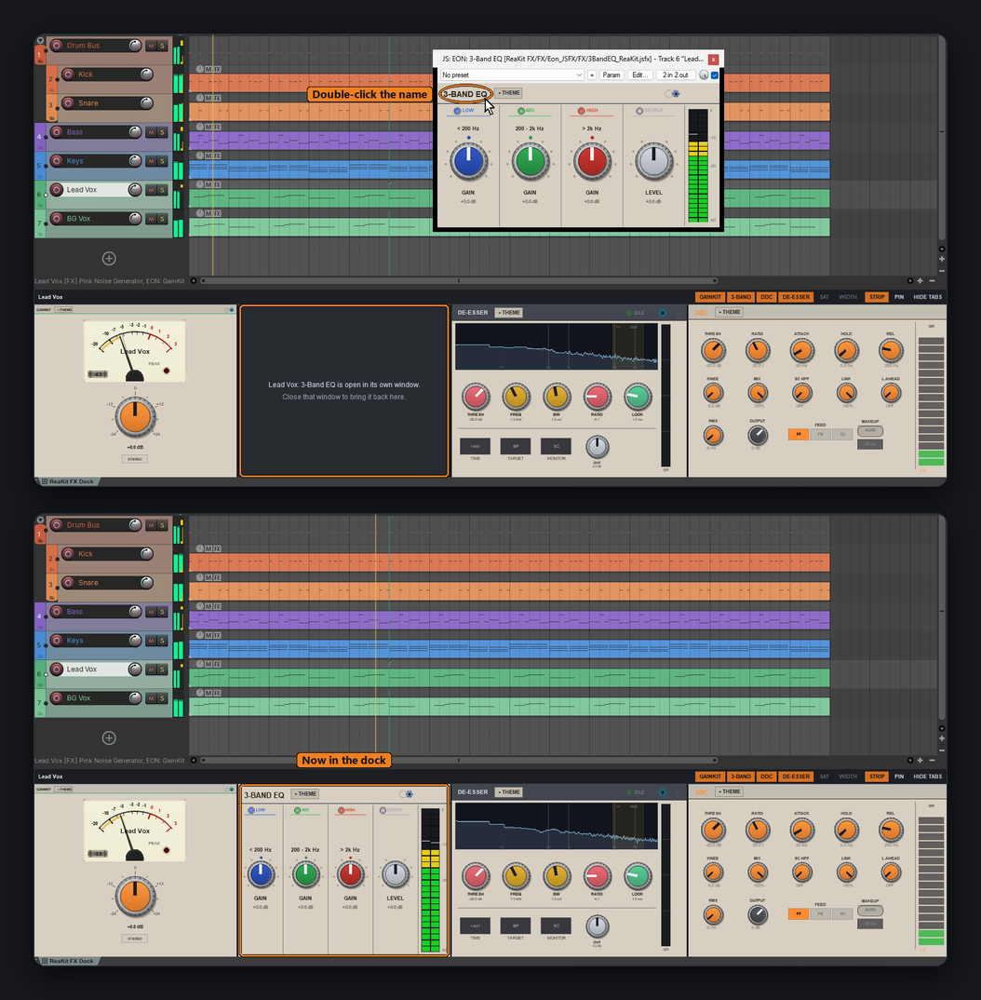

With GainKit Plus running, double-click a plugin's name at the top of its own window and it goes
into the dock, on its track (the dock opens if it was closed); double-click it in the dock and it
comes back out into its own window. Open an effect's
own window, its mixer strip or the FX chain on it, and the dock steps aside until that window
closes; its place in the dock says so.

### Right-click to add

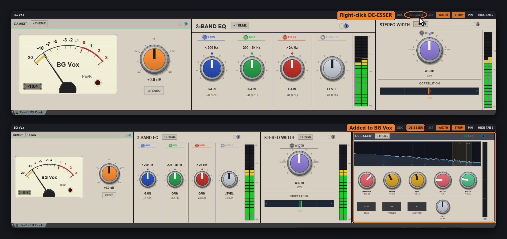

A dim button on the bar is an effect the track does not have. Right-click it to add it to the
track the bar names: GainKit first in the chain, the others at the end. Right-click a lit one for
its menu: show it in the dock, open it in its own window, bypass it, move it to the start or the
end of the chain, or remove it (one undo step). Right-click the track's name, icon, number or the
bar's empty space for the track's menu: rename, colour, pick or remove the icon, icons follow the
colour, close this track's or every track's windows, pin.

### The bar

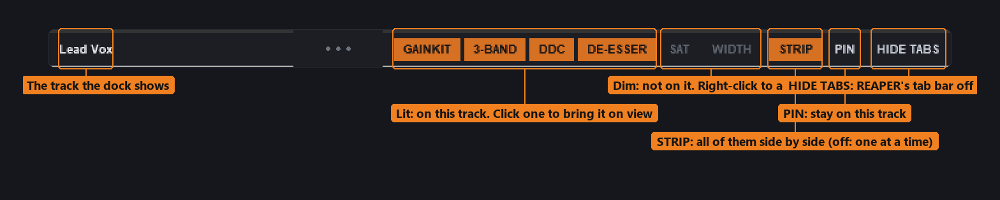

- the track's number, icon and name, with its colour as a stripe along the top (or a band across
  the bar, or none: the gear). The number sits on a swatch of the track's colour: click it for a
  palette of 16 colours, None and More... (REAPER's colour dialog), which colours the shown track,
  or every selected track when the shown one is among them, in one undo step. Click the name to rename the track right there: type, Enter sets it,
  Escape puts the old name back. Click the icon, or the faint square where one would sit, to open
  the icon picker;
- a chip for each effect, in the order of the track's chain: a lit one is on the track (click it
  to bring it on view), a dim one is not (right-click it to add it). Drag a chip to move the effect
  in the chain; drag a dim one in to add the effect at that spot. A grey marker stands for another
  plugin in the chain;
- two close icons: this track's floating effect windows, or every track's;
- **STRIP** — every one of the seven on the track side by side, as many as fit at a usable width;
  `<` `>`, an effect's chip or the mouse wheel over the bar bring the rest on view. With STRIP off,
  the effect you pick fills the dock;
- the pin — the dock stays on this track (or the master) whatever you select;
- **SLOT** — every mixer strip on screen scrolls its effect list to the same row at once: a click
  lists Top, Slot 2 and on, and the wheel over it steps through them. It moves the mouse pointer
  over the strips for a moment while it works, and puts it back;
- **HIDE TABS** / **SHOW TABS** (**TABS** in a narrow dock) — the same as the Docker tabs action
  below;
- the gear — the bar's options: the layout (Auto lays the effects side by side in a docker under
  the tracks and stacks them, each the dock's full width, in a side docker or any dock taller than
  it is wide; Across and Down force one), the track number, the track icon, the colour (off, a stripe, a
  band), full or short effect names, whether a double-click pops an effect out, whether the bar
  folds to a thin handle (the chevron folds it, a click on the handle drops it back down), the
  track colour on that handle, whether the menu stays open until you close it, and **Tooltips** (on to
  start; off hides the bar's and the icon picker's tips). **Pick a track
  icon...** opens our own picker: REAPER's icons in a grid with a search box (Enter picks the first
  match), sorted into groups, Drums, Guitars, Bass, Keys, Synths, Strings, Brass, Winds, Vocals, Mics, Buses, FX, Rooms, Marks, Folders; a click sets the
  shown track's icon in one undo step, a double-click sets it and closes, and the current one is
  marked. ReaKit FX also brings its own set of 104 track icons (drums piece by piece and drum
  overheads, percussion, keys and synths, guitar and bass with an amp each and a DI box, strings,
  brass and winds, a dynamic and a condenser mic, vocals, headphones, buses, a VU meter, the common
  effect types, a turntable and drum machines, marks and more), drawn in REAPER's icon grey with a
  dark outline that holds on light themes, in a folder of their own, the EON category; they also
  join REAPER's icons in the groups (Drums holds both), and add groups of their own (Percussion,
  Amps, Machines...). Groups have groups inside them: click Drums and a second row shows the way
  you came (Drums ›) and its parts, Kick, Snare, Toms, Hi-hats, Cymbals, Overheads and kit; click
  one to narrow down, click a step of the way to go back up. However deep a group goes, it takes
  that one row. **+ Folder** adds any folder of icons of your own, and each of its subfolders becomes a
  category, a folder inside a folder a sub-category. **+ Group** makes a group of your own, and a
  group's right-click menu adds a sub-group inside it, renames it or deletes it (its icons move up a
  level); right-click an icon to put it in a group or mark
  it a favourite. Favourites and Recent get their own pills, or put every category in a list down
  the side, where the groups open as a tree. A Size slider sets the icons from 28 to 96 px, with the names under the icons from 64 up; the arrow keys move a
  highlight and Enter picks it; an icon another selected track wears gets a thin outline; "All
  selected tracks" sets every selected track at once; "Close after a pick" does what it says; and the
  window remembers where you left it. **Icons follow the track
  colour** (off to start) paints a coloured track's icon in its colour, the light body coloured and
  the outline and shading left as drawn: a copy of the icon, made once
  per colour and icon for the whole machine and shared by every track and project that uses that
  pair; the plain icon comes back when the colour goes or the option goes off. The picker's Colour
  slider sets how strongly the colour paints the icon, from a light wash to the full colour. The menu and the picker need
  ReaImGui; without it, the gear shows a plain menu and the picker row opens REAPER's own icon
  dialog;
- the chevron at the far left folds the bar; the X at the far right closes the dock.

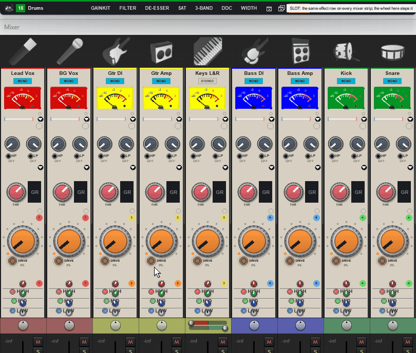

*SLOT: Slot 3, Slot 5, then back to the top, on every strip at once.*

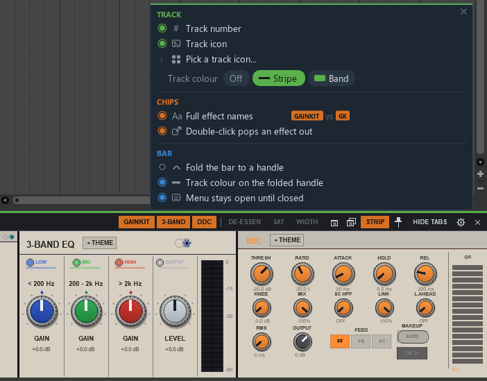

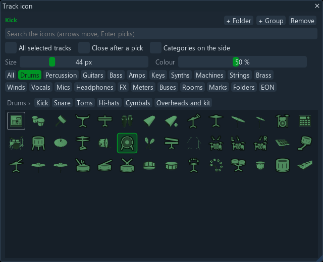

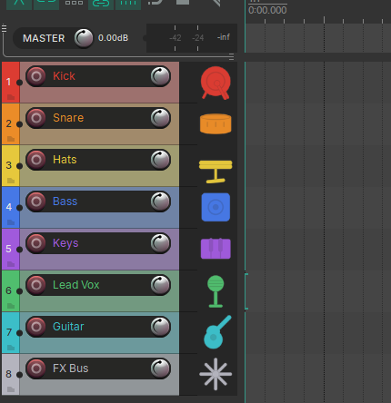

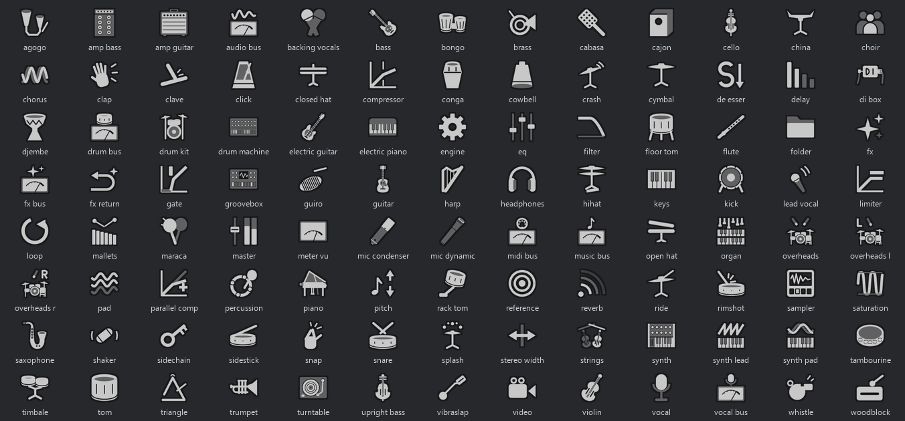

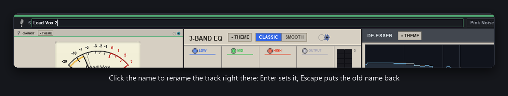

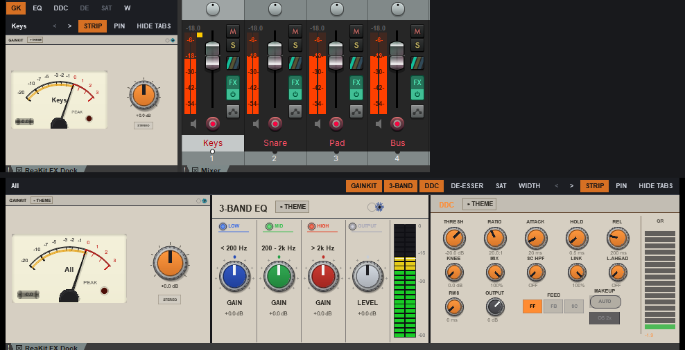

*Narrow, it shows one effect at a time; wider, as many as fit.*

### Docker tabs

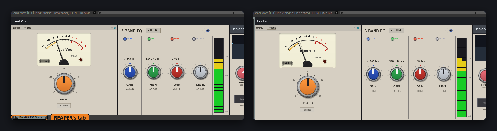

**HIDE TABS** on the bar, or the action **ReaKit FX - Docker tabs off-on**, turns off REAPER's
tab bar for every docker holding one window, so the dock gets that room (a docker holding two
keeps its tabs, to switch between them). Run it again and the tabs are back as they were. It is
REAPER's own setting, so it holds for every docker and after a restart.

## Across the plugins

- **Presets** — each effect has factory presets in REAPER's preset menu at the top of its
  window, named for the job: Vocal Smooth, Kick Punch and Drum Bus Glue on DDC, Vocal Standard and
  Hi-Hat Tame on the De-Esser, Warmth, De-Mud and Telephone on the 3-Band EQ, Rumble, Air cut and
  Telephone on the Filter, and more on Saturation, Stereo Width and GainKit (74 in all). The DDC and De-Esser presets are tuned to a set
  amount of reduction. A preset sets the sound and leaves the look, the link group and GainKit's
  name as they are.
- **Embeds** — every plugin has a face for the mixer strip and the track panel, sized from the
  slot it is given. The THEME panel's EMBED row (MCP / TCP / OFF) moves a plugin between the mixer
  strip, the track panel and neither, and sets where new copies of all seven open; GainKit Plus does
  the moving, and the row says NEEDS PLUS while it is not running.
- **THEME panel** — all seven have a THEME toggle in the header: a colour theme, a knob style (21 of
  them), the name bar over the mixer-strip embed, EMBED, and NATIVE, each plugin in its own original
  colours. Three colour themes are built in and work on their own: **EON**, **Dark** and **Light**.
  Pick one, or NATIVE, on any of the seven and all seven follow, open or closed, and the choice comes
  back with the project: opening a project wears the theme it was saved with. Eleven more
  (SSL, Neve, API, Tube, Ableton, FL Studio, Pro Tools, PT Light, and three that copy your REAPER
  theme) appear in the list when EON Swing is installed, whose bridge paints them and keeps the
  whole suite in step.

  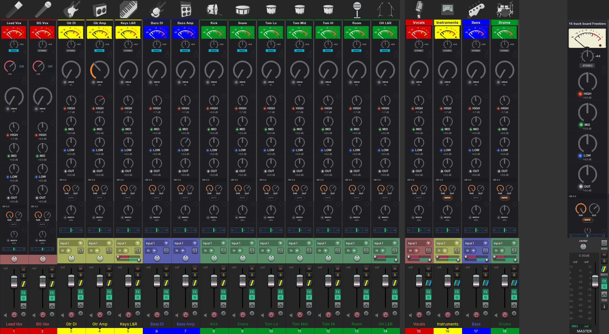

  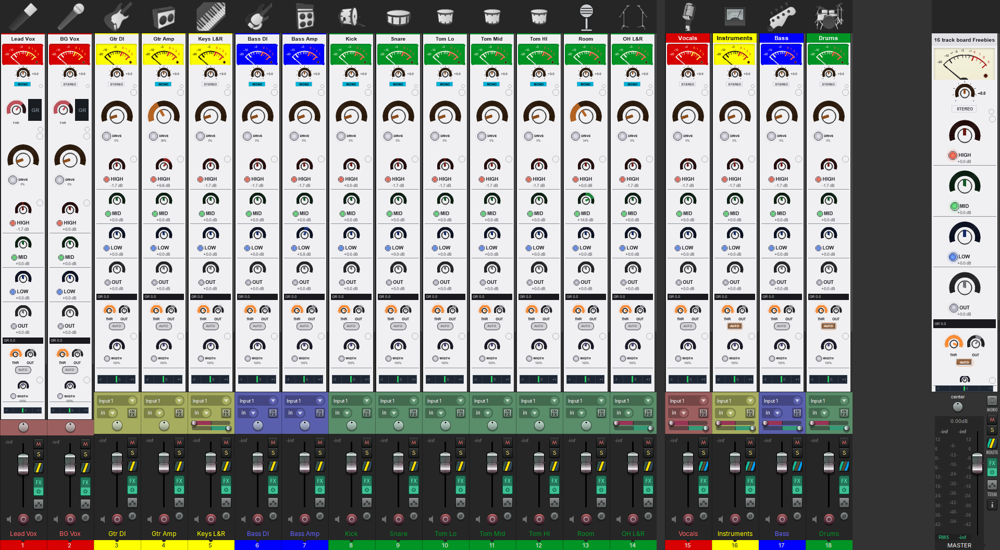

  *The same session on Dark and on Light (EON is at the top of this page), on a machine without
  Swing.*

  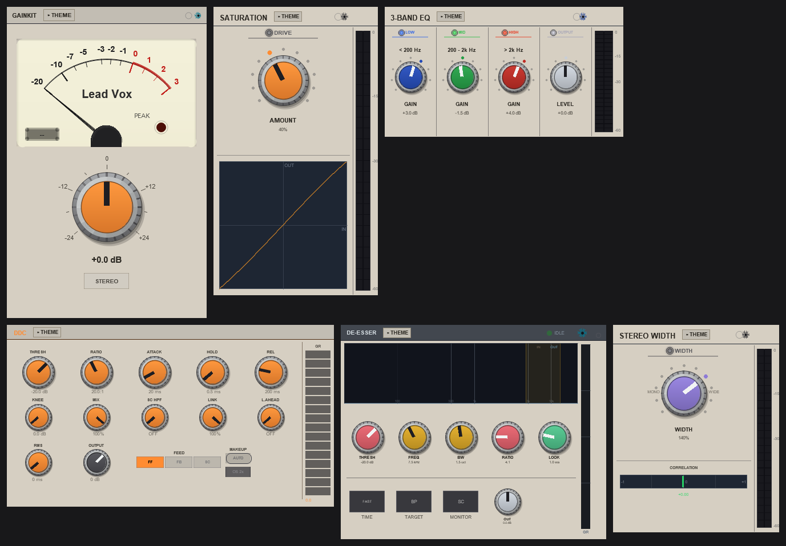

  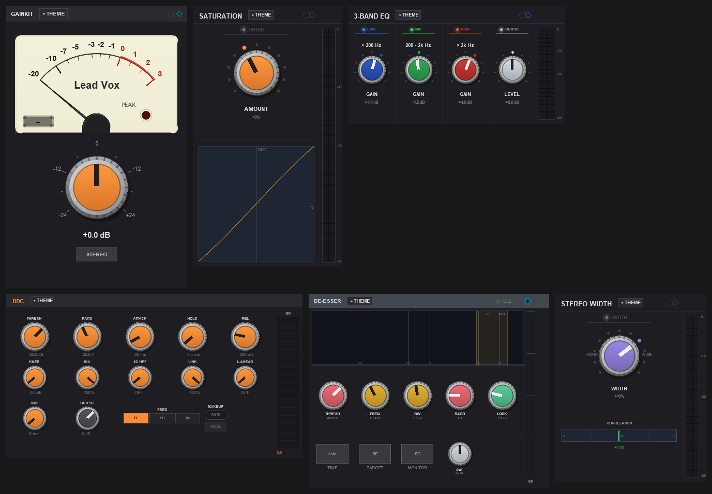

  

  *Six of the seven windows on the three built-in themes.*

  GainKit's panel also picks the VU's face, what the strip shows, the name's row (ROW, BAND or
  OFF) and its FONT, the meter's colour (FACE or TRACK), when the VU alone prints the gain (TOUCH
  or ALWAYS), one needle or two meters (METERS), whether the strip's meter sets the gain (VU DRAG)
  and whether the strip shows its STEREO / MONO key (ST/MONO), and has LOCK, which freezes that
  instance's look while the rest follows the theme. It has two pages: LOOK (the theme, the knob,
  the VU's face and colour, METERS, LOCK) and STRIP (everything about the mixer strip), and a line
  at the bottom says what the row under the mouse does.

  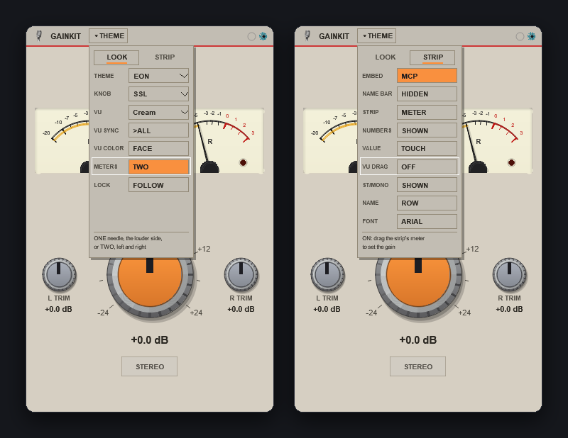

  **With EON Swing** — its bridge paints the other eleven themes and keeps the whole suite in step:

  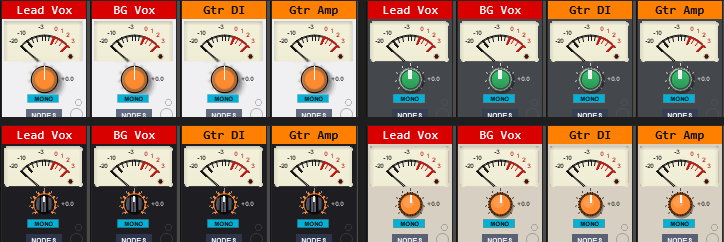

  *GainKit's strips on the Light, SSL, Dark and EON themes: the colours and the knob follow the
  theme, the name bands keep the track's colour.*

  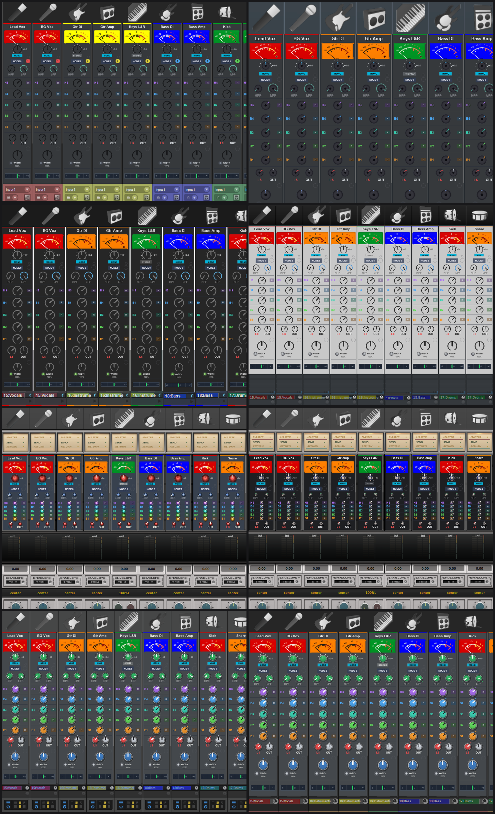

  *The same session's strips on eight REAPER themes and knob styles: GainKit, the suite's 4-Band EQ
  and Stereo Width on every track, its compressors on the buses, drawn to fit whatever the theme
  gives them.*

  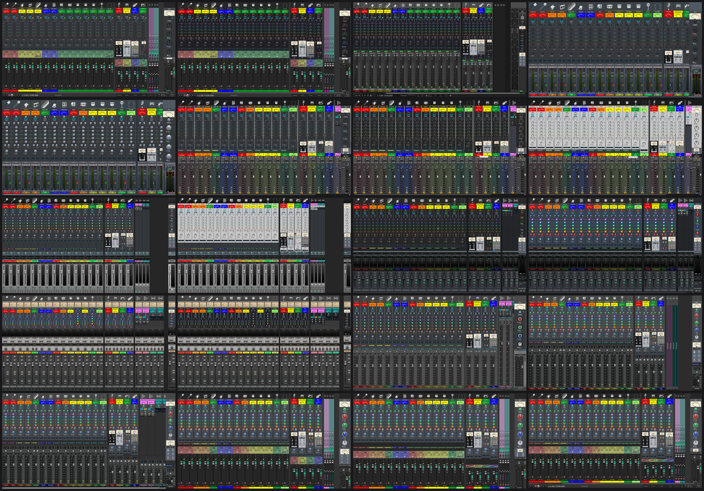

  *Twenty of them at a glance.*

  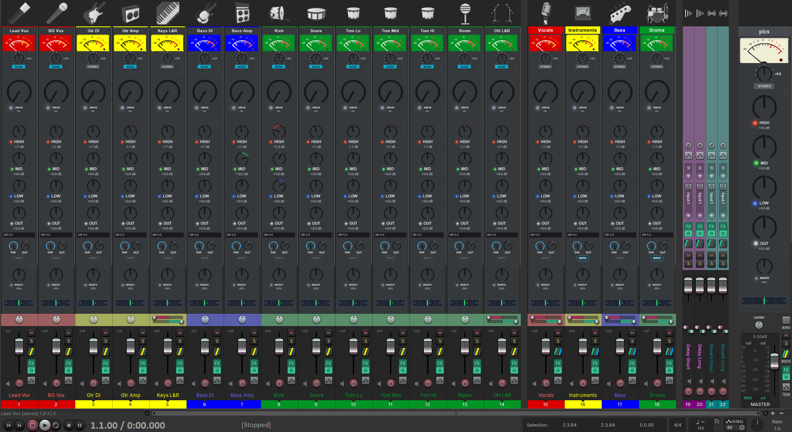

  *The same session with the knobs in the Dark Ableton style: the strip goes quiet and the
  values stay readable.*
- **Link groups** — the gear in the header of those five puts an instance in a group; instances
  in the same group move together. A plugin joining a group takes its settings only from members
  still running, so a group whose plugins are gone starts from the newcomer's own. A group belongs
  to REAPER, not to one project: with background project tabs set to keep playing, group 1 in one
  tab and group 1 in another are the same group, so give each project its own group numbers.
- **The mouse** — drag a knob, Ctrl for fine, Shift for finer, the wheel steps it, double-click
  resets it, right-click returns it to its default.
- **Snappier strips** — REAPER redraws an embedded strip at its meter rate, 30 a second out of the
  box. Set Preferences > Appearance > Track meter settings > Meter update frequency to 120 (the
  Start with REAPER action offers this once) and the knobs in the mixer and the track panel answer
  quicker. A strip nothing is changing on skips its redraw, so a big session stays quick.

## Install (ReaPack)

1. No Extensions menu in REAPER? Get ReaPack free at [reapack.com](https://reapack.com). In REAPER, open
   **Options > Show REAPER resource path**, put the file in the **UserPlugins** folder there, and restart
   REAPER. If ReaPack shows a list of repositories the first time, just click OK.
2. **Extensions > ReaPack > Import repositories**, paste this address and click OK:

   ```
   https://raw.githubusercontent.com/mequaz-sudo/ReaKit-FX/main/index.xml
   ```

3. **Extensions > ReaPack > Browse packages.** Type **ReaKit**, check that five packages show (ReaKit FX, GainKit Plus, EON Floatter,
   ReaKit FX templates, ReaKit FX track icons), click **Select all**, then **Actions > Install/update selection**. Then type **js_ReaScriptAPI**, click that one package
   and install it the same way. Then type **ReaImGui**, click only the one called "ReaImGui: ReaScript
   binding for Dear ImGui" and install it: EON Floatter needs both. Click **Apply**, then restart REAPER.
4. **Actions > Show action list.** Type **ReaKit FX - Start**, pick it and click **Run/close**. GainKit Plus and
   EON Floatter start with REAPER from then on, and new copies of the seven open in the mixer strip. A small
   window shows what it set up: leave **Faster mixer strips** on (switch on **Open the 16 track board** to start
   a mix from it), click **OK**, then restart REAPER.
5. Add a track, click its **FX** button, type **EON** and add `JS: EON: GainKit`. Close the effects
   window REAPER opens, then drag the top edge of the mixer up (**View > Mixer** if you don't see it). The
   others are in the same list as `JS: EON: Saturation`, `JS: EON: 3-Band EQ`, `JS: EON: DDC`,
   `JS: EON: De-Esser`, `JS: EON: Stereo Width` and `JS: EON: Filter`. Or add all seven at once:
   **Track > Insert track from template > ReaKit FX - All seven** (from the ReaKit FX templates package). Or start a
   whole mix from **File > New project from template > ReaKit FX - 16 track board**: fourteen tracks and four buses,
   each with GainKit, Filter, De-Esser, Saturation, 3-Band EQ, DDC and Stereo Width.
6. To change the look, open the plugin's window (the track's FX button) and click **THEME** at the top.

Bought ReaKit FX before, as a download? Delete those old files from REAPER's Effects folder first, so
nothing shows up twice. Updates arrive through **Extensions > ReaPack > Synchronize packages**.

**EON Floatter** ships here too (the ReaKit library has an older copy; having both is harmless,
only one ever runs). The action above starts it, or run it once yourself from the action list; it stays on: every EON window opens at
its designed size, any JSFX window can be captured at a size of your own, and one dial scales them
all. It needs js_ReaScriptAPI, and its panel needs ReaImGui, both from ReaTeam Extensions.

These effects used to ship from the ReaKit repository as "ReaKit Free FX". If you installed them
there, ReaPack now lists that package as obsolete: uninstall it and install this one.

## Licence

Saturation, 3-Band EQ and DDC keep their DSP author's terms, Michael Gruhn (LOSER); the De-Esser's
crossover and detector are Lubomir I. Ivanov's (Liteon), under the GPL as he released it, and the
GPL's full text is beside it ([DeEsser_ReaKit.GPL-3.0.md](Eon_JSFX/FX/DeEsser_ReaKit.GPL-3.0.md)).
Each plugin file carries its author's original header, word for word. GainKit, Stereo Width,
Filter, the GainKit Plus scripts, EON Floatter, the templates and the track icons are EON Studios'
own work, MIT, and so are the `ReaKit/` includes. The details are in [LICENSE.md](LICENSE.md).

## Building on it

The `ReaKit/` folder holds the ReaKit files the plugins import (`import ../../ReaKit/<file>`);
the ones the ReaKit library also publishes match its 1.7.2 release, except `rk_vu`, which is a step ahead
(it has GainKit's two-meter code, which goes into the library next). Nothing else is
needed: install the package and the plugins compile. To write your own, start from the
[ReaKit](https://github.com/mequaz-sudo/ReaKit) repository's showcase and Starter.

*Every picture here is a screenshot of a working session, on the SSL, Light, Dark and EON themes,
cropped and never painted over: every pixel is the plugin drawing itself.*
