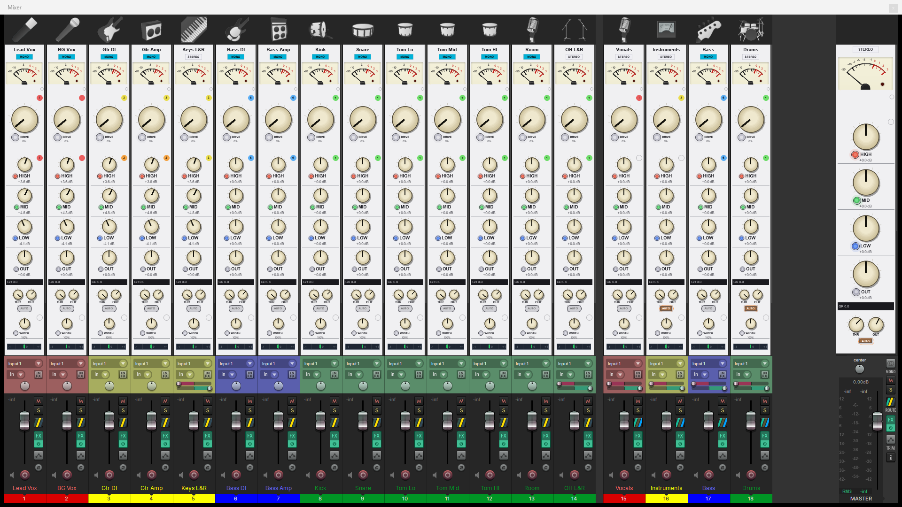
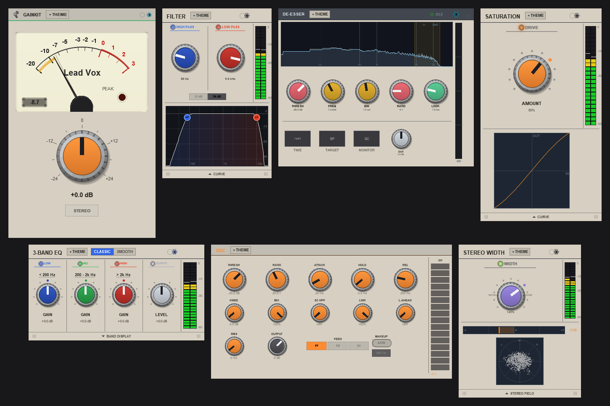

# ReaKit FX

Seven free effects for REAPER that live right in your mixer strip: **GainKit**, **Filter**, **De-Esser**,
**Saturation**, **3-Band EQ**, **DDC** and **Stereo Width**. Pick a theme or a knob style on one and all seven
follow. Every face is drawn in code, so it stays sharp at any size and on HiDPI screens. **GainKit Plus** adds
actions and a dock that keeps the selected track's effects in view.

The full guide, every knob explained: [eonaudio.pro/reakit-free-fx](https://eonaudio.pro/reakit-free-fx).
To install, see [Install](#install-reapack).



*The 16 track board from the templates package: GainKit, Filter, De-Esser, Saturation, 3-Band EQ, DDC and Stereo
Width on every channel and bus. Click a strip's empty space to open a plugin's window, click again to close it.*

## The plugins



### GainKit

Gain staging on a VU meter: one GAIN knob, a STEREO / MONO key and twenty meter faces. The needle reads the
louder side; set METERS to TWO for a meter per side, with a trim for each. In the mixer strip it shows the VU
over the knob, the VU alone or the knob alone, with the track's name on top. With **VU DRAG** on, the strip's
meter is the gain control: drag it, scroll it, double-click for 0 dB.

A low and a high cut are options in the THEME panel (off to start): FILTERS on the LOOK page for the window, on
the STRIP page for the strip. With GainKit Plus running, the strip's cut bar gets an arrow that opens the **long
view**, the curve right in the mixer; the strip grows to fit and the sound plays straight through. The Filter
has the same arrow.


The METER page sets where 0 VU sits (-18, -20 or -14 dBFS), how fast the needle moves, what marks the last high,
and when the PEAK light comes on.

Six **look presets** in REAPER's preset menu set GainKit up for the job: Mono track (MONO on), Stereo track, Bus,
Headphone cue and Master; Default look puts it back. The gain, trims and cuts stay where they are.


### Filter

A high-pass and a low-pass, each 20 Hz to 20 kHz, 12 or 24 dB per octave. A knob at the end of its travel is
off, and a click on its light switches the filter off and back to where it was. Sweeps and automation are smooth.
The CURVE drawer shows the response with a node per filter to drag. In the mixer it is the two knobs.


### De-Esser

Built on Liteon's de-esser: threshold, frequency, bandwidth, ratio and lookahead, a time setting, a band-pass or
high-pass target, and MONITOR to hear only what it catches. The display shows the band it listens to.

### Saturation

LOSER's saturation: one DRIVE knob, an on / off light and an output meter. The CURVE drawer shows what the drive
does to the signal.

### 3-Band EQ

LOSER's three-band EQ: low, mid and high, 24 dB up or down, two crossovers, an output level and a switch per
band, in two voices, CLASSIC and SMOOTH. With every knob at zero the sound comes out as it went in. The band
display drawer has a dot per band to drag, and the crossover lines drag too.


### DDC

LOSER's Digital Drum Compressor: threshold, ratio, attack, hold, release, knee, mix, a sidechain high-pass,
stereo link, up to 5 ms of lookahead, RMS or peak, feed-forward, feedback or an external sidechain, auto makeup,
DET 2x (the level detector at double rate) and a gain-reduction meter.

### Stereo Width

One knob, 0 to 200 %: mono, the recorded width at 100 %, twice as wide at 200 %. The middle of the mix stays
where it is. A correlation meter sits under the knob, and the STEREO FIELD drawer shows the stereo picture live.

## GainKit Plus

Install **GainKit Plus** from the same repository. Its actions are in the Actions list:

- **GainKit Plus**: every GainKit shows its track's name, colour and icon; the master shows the project's name.
  It also runs the THEME panel's EMBED row and the long-view arrow. Run it again to stop.
- **ReaKit FX - Start with REAPER**: GainKit Plus and EON Floatter on at every launch, the seven set to open in the
  mixer strip; it offers a track with all seven, the 16 track board and a faster meter refresh.
- **GainKit Plus - Start with REAPER**: starts only GainKit Plus with REAPER.
- **Insert on selected tracks**, **GainKit first in every chain**, **GainKit first on selected tracks**,
  **GainKit last on the master**.
- **Copy look to all**, **Reset all gains**, **All MONO**, **All STEREO**, **Bypass all**, **Remove all GainKits**.
- **ReaKit FX - Add a track with all seven**: one track, their windows open side by side.
- **ReaKit FX - Dock following the selected track**: [the dock](#the-reakit-fx-dock).
- **ReaKit FX - Docker tabs off-on**: REAPER's tab bar off for every docker holding one window, and back.


## The ReaKit FX dock


Select a track and its ReaKit FX open in a docker, whole and working. **PIN** keeps the dock on one track.
**STRIP** shows every effect on the track side by side; with it off, the one you pick fills the dock. With GainKit
Plus running, double-click a plugin's name at the top of its window to move it into the dock, and double-click it
there to pop it back out.
The dock runs on Windows and needs js_ReaScriptAPI.


The bar along the top shows the track's number, icon and name: click the number for a colour palette, the
name to rename the track, the icon to pick a new one. There is a chip per effect in chain order. Drag a chip to
move the effect, click it to bring it on view, and right-click a dim one to add that effect to the track.
**SLOT** scrolls every mixer strip on screen to the same effect row at once.


The icon picker sorts REAPER's icons and our own 104 into groups, with groups inside them (Drums, then Kick,
Snare, Toms...). It has a search box, a size slider, favourites, and your own folders and groups. **Icons follow
the track colour** (off to start) paints a coloured track's icon in its colour. The picker and the gear menu use
ReaImGui; without it the gear shows a plain menu and REAPER's own icon dialog opens instead.


## Themes

Three themes are built in, **EON**, **Dark** and **Light**, plus **NATIVE**, each plugin in its own colours, and
21 knob styles. Pick one on any of the seven and all seven follow; a project opens on the theme it was saved
with. With EON Swing running, they also follow the theme picked in Swing (SSL, Neve, API and more).


## Across the plugins

- **Presets**: 80 factory presets in REAPER's preset menu, named for the job (Vocal Smooth, Kick Punch, Drum Bus
  Glue, Hi-Hat Tame, De-Mud...). A preset sets the sound and leaves the look alone; GainKit's six look presets set
  the look (Mono track and Stereo track also set MONO).
- **Mixer strip or track panel**: the THEME panel's EMBED row moves a plugin between the two, with GainKit Plus
  running.
- **Link groups**: six of the seven have sixteen link groups; turn a knob on one and its group follows.
- **The mouse**: drag a knob, Ctrl for fine, Shift for finer; the wheel steps it; double-click resets it.
- **Snappier strips**: set Preferences > Appearance > Track meter settings > Meter update frequency to 120
  (the Start action offers it) and the knobs in the strips answer quicker.

## Install (ReaPack)

1. No Extensions menu in REAPER? Get ReaPack free at [reapack.com](https://reapack.com). In REAPER, open
   **Options > Show REAPER resource path**, put the file in the **UserPlugins** folder there, and restart REAPER.
2. **Extensions > ReaPack > Import repositories**, paste this address and click OK:

   ```
   https://raw.githubusercontent.com/mequaz-sudo/ReaKit-FX/main/index.xml
   ```

3. **Extensions > ReaPack > Browse packages.** Type **ReaKit**, check that five packages show (ReaKit FX, GainKit
   Plus, EON Floatter, ReaKit FX templates, ReaKit FX track icons), click **Select all**, then **Actions >
   Install/update selection**. Then install **js_ReaScriptAPI** the same way, and **ReaImGui** (the one called
   "ReaImGui: ReaScript binding for Dear ImGui"). Click **Apply** and restart REAPER.
4. **Actions > Show action list**, type **ReaKit FX - Start**, pick it and click **Run/close**. Leave **Faster
   mixer strips** on in the window it shows, click **OK** and restart REAPER.
5. Add a track, click its **FX** button, type **EON** and add `JS: EON: GainKit` (the other six are in the same
   list). Or **Track > Insert track from template > ReaKit FX - All seven**, or start a mix from **File > New
   project from template > ReaKit FX - 16 track board**.

To change the look, open a plugin's window and click **THEME**. Updates arrive through **Extensions > ReaPack >
Synchronize packages**. Bought ReaKit FX before, as a download? Delete those old files from REAPER's Effects folder
first, so nothing shows up twice. Installed "ReaKit Free FX" from the ReaKit repository? ReaPack lists it as
obsolete: uninstall it and install this one.

**EON Floatter** opens every EON window at its designed size, captures a size of your own for any JSFX, and
scales them all with one dial. It needs js_ReaScriptAPI; its panel needs ReaImGui.

## Licence

Saturation, 3-Band EQ and DDC keep their DSP author's terms, Michael Gruhn (LOSER); the De-Esser's crossover and
detector are Lubomir I. Ivanov's (Liteon), under the GPL as he released it, with the GPL's full text beside it
([DeEsser_ReaKit.GPL-3.0.md](Eon_JSFX/FX/DeEsser_ReaKit.GPL-3.0.md)). Each plugin file carries its author's
original header, word for word. GainKit, Stereo Width, Filter, the GainKit Plus scripts, EON Floatter, the
templates, the track icons and the `ReaKit/` includes are EON Studios' own work, MIT. Details in
[LICENSE.md](LICENSE.md).

## Building on it

The `ReaKit/` folder holds the ReaKit files the plugins import (`import ../../ReaKit/<file>`); install the package
and the plugins compile. To write your own, start from the [ReaKit](https://github.com/mequaz-sudo/ReaKit)
repository's showcase and Starter.
