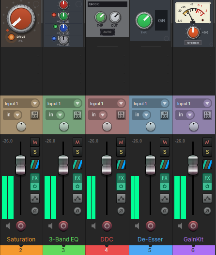
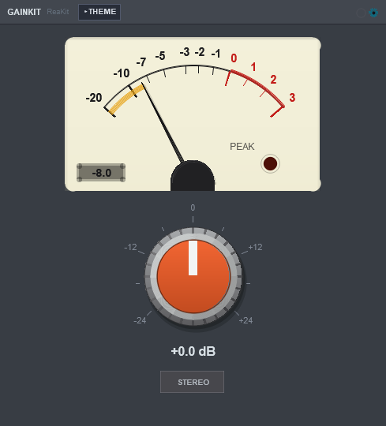
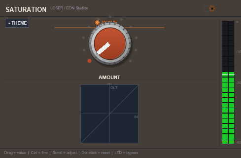
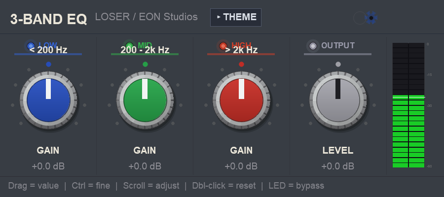
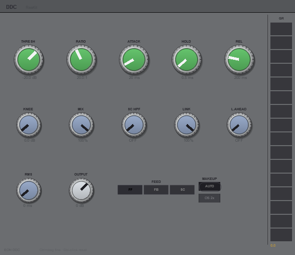

# ReaKit FX

Five free effects for REAPER with EON Studios interfaces, drawn by the
[ReaKit](https://github.com/mequaz-sudo/ReaKit) library: Saturation, 3-Band EQ and DDC by
LOSER, a De-Esser built on Liteon's, and GainKit, EON's own gain-staging plugin. Every face is
code, no image files, so it scales to any size and renders at full resolution on HiDPI.



*All five embedded in the mixer at the default strip width. Click a strip's empty space to open the
window, click the strip again to close it.*

## The plugins

### GainKit



Gain staging on a VU. An analog VU meter (the ReaKit meter: 300 ms to 99 %, 1.2 % overshoot, 20
faces), one GAIN knob and a STEREO / MONO key. In the mixer strip it shows the VU over the knob,
the VU alone, or the knob alone, with numerals or ticks only, and the VU grows flatter as you drag
the strip wider. Click the middle of the meter's face and type, and the name is printed on the meter
like a legend. The high-pass, low-pass, trims and M/S modes it used to show are still there as
parameters, so old projects sound the same.

### Saturation



LOSER's saturation: one DRIVE knob, a transfer display that shows what the drive is doing to the
signal, and an output meter. The LED bypasses it.

### 3-Band EQ



LOSER's three-band equalizer: low, mid and high gain with the two crossover frequencies, an output
level, and a switch per band. The standalone window draws everything at one scale, so a wider
window gets bigger knobs, not more empty space.

### DDC



LOSER's Digital Drum Compressor: threshold, ratio, attack, hold and release, knee, mix, a
sidechain high-pass, stereo link, lookahead, RMS or peak detection, feed-forward, feedback or an
external sidechain, auto makeup, oversampling, and a gain-reduction meter.

### De-Esser


Built on Liteon's de-esser: threshold, frequency, bandwidth, ratio and lookahead, a fast time
setting, a band-pass target instead of the broadband one, and a switch to monitor the sidechain.
The display shows the band it is listening to.

## In every plugin

- **THEME panel** — the header's THEME toggle opens it: a colour theme, a knob style (21 of them),
  the VU's face where there is a VU, the name bar over the mixer-strip embed, and LOCK, which
  freezes this instance's look while the rest of the suite follows the theme. NATIVE opts an
  instance out of theming.
- **Embeds** — every plugin has a face for the mixer strip and the track panel, sized from the
  slot it is given.
- **Link groups** — the gear in the header puts an instance in a group; instances in the same
  group move together.
- **The mouse** — drag a knob, Ctrl for fine, Shift for finer, the wheel steps it, double-click
  resets it, right-click returns it to its default.

## Install (ReaPack)

Extensions > ReaPack > Import repositories, paste:

```
https://raw.githubusercontent.com/mequaz-sudo/ReaKit-FX/main/index.xml
```

Then install **ReaKit FX** from the browser. The plugins appear in REAPER's FX list as
`JS: EON: GainKit`, `JS: EON: Saturation`, `JS: EON: 3-Band EQ`, `JS: EON: DDC` and
`JS: EON: De-Esser`.

These effects used to ship from the ReaKit repository as "ReaKit Free FX". If you installed them
there, ReaPack now lists that package as obsolete: uninstall it and install this one.

## Licence

Saturation, 3-Band EQ and DDC keep their DSP author's terms, Michael Gruhn (LOSER); the De-Esser's
crossover and detector are Lubomir I. Ivanov's (Liteon). Each plugin file carries its original
header. GainKit is EON Studios' own code, MIT. The `ReaKit/` includes are the ReaKit library, MIT.
The full text is in [LICENSE.md](LICENSE.md).

## Building on it

The `ReaKit/` folder is a copy of the ReaKit library the plugins import (`import
../../ReaKit/<file>`), byte-identical to the released library. Nothing else is needed: install
the package and the plugins compile. To write your own, start from the
[ReaKit](https://github.com/mequaz-sudo/ReaKit) repository's showcase and Starter.

*The screenshots are a script's: a sandbox REAPER at 100 % opens each window and embeds the five
in a mixer, and the pictures are cropped to the plugin's canvas. Every pixel is the plugin drawing
itself.*
